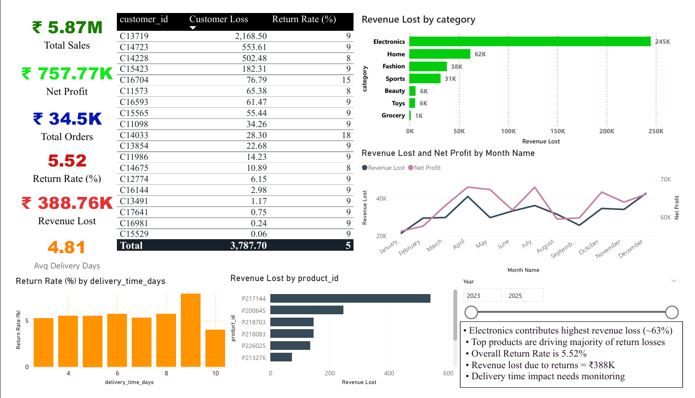
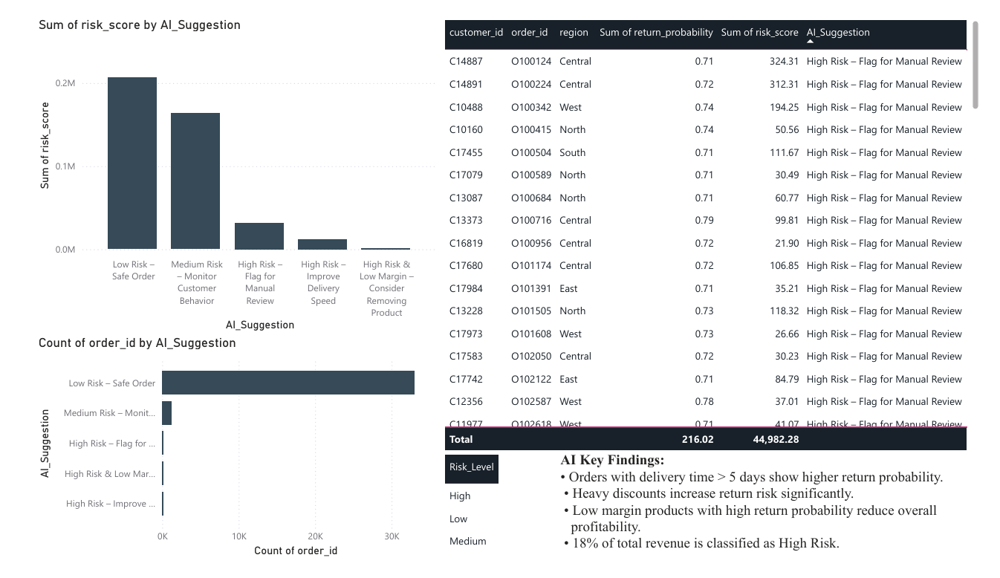
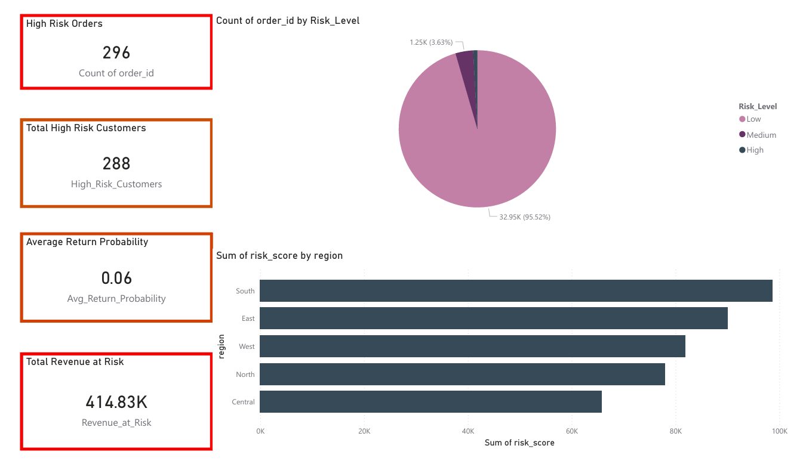

# AI-Powered Profit Leakage & Return Risk Intelligence System

## 📌 Project Overview
This project identifies profit leakage and predicts high-risk product returns in an e-commerce business using AI and data analytics.

It helps answer:
- Where are we losing profit?
- Which products/customers are high risk?
- What action should be taken?

---

## 🛠 Tools & Technologies Used

- Power BI (Dashboard & Visualization)
- Python
- Pandas
- NumPy
- Scikit-learn (Machine Learning Model)
- Random Forest Algorithm
- Linear Regression
- Matplotlib
- Kaggle Dataset

---

## 🤖 AI Implementation

This project uses machine learning to predict returns and future profit.

### 1️⃣ Return Risk Prediction
- Model Used: Random Forest
- It predicts whether an order will be returned or not.
- It gives a return probability score.
- Orders are classified as Low, Medium, or High Risk.

### 2️⃣ Profit Forecasting
- Model Used: Linear Regression
- It predicts profit for the next 3 months.
- Helps understand future revenue trends.

### 3️⃣ AI Suggestions
- Based on return risk, profit margin, delivery time, and discount.
- Automatically suggests actions like:
  - Reduce discounts
  - Improve delivery speed
  - Review high-risk products
    
---

## 📊 Dashboard Features

- Total Revenue
- Net Profit
- Return %
- Revenue Lost due to Returns
- High-Risk Products
- Region-wise Profit Analysis
- AI Insights & Recommendations Page

---

## 🚀 Business Impact

- Identifies loss-making products
- Flags high-risk customers
- Suggests operational improvements
- Reduces return-driven losses

---

## 📷 Dashboard Preview

### Main Dashboard 
### AI Insights  
### High Risk Analysis 

---

## 👩‍💻 Author
Deeksha Mohan
